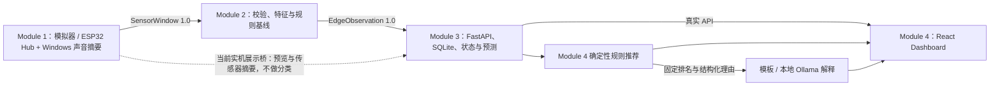

# Privacy-Preserving Study Space Advisor

[](https://github.com/Momoyo66c/privacy-preserving-study-space-advisor/actions/workflows/gate-a-ci.yml)
[](https://github.com/Momoyo66c/privacy-preserving-study-space-advisor/actions/workflows/backend-ci.yml)
[](https://github.com/Momoyo66c/privacy-preserving-study-space-advisor/actions/workflows/module1-ci.yml)
[](https://github.com/Momoyo66c/privacy-preserving-study-space-advisor/actions/workflows/repository-check.yml)

面向校园学习空间的隐私保护型 AIoT 推荐系统。ESP32 Sensor Hub 采集低分辨率热阵列、相对光照和温湿度；由于现有 HW-485 无法稳定区分持续声强，当前实机演示使用 Windows 麦克风在内存中计算相对 RMS、标准差和峰值，再通过认证的 SSH 回环隧道交给 Raspberry Pi 5。边缘流程把数据转换为不含身份信息的房间状态摘要；后端负责状态、历史、短期预测、登录会话、选择记录和偏好学习；React Dashboard 展示房间状态、实时传感器、推荐、趋势和隐私说明。共享契约保留可选雷达字段，但最终生产硬件不安装雷达。

> 状态快照（2026-07-27）：Module 1 实机链路、Windows 声音摘要替代方案、四场景真实样本、Module 2 规则基线、Module 3 后端、React Dashboard 和 Gate A 已具备；当前交付补齐了 Module 4 正式推荐、模板/Ollama 解释与 Gate C 本机验证。

## 当前系统链路



Gate A 已证明模拟链路可以从 Module 1 连续运行到真实后端和浏览器。实机采集、匿名会话、实时预览以及四份真实会话的离线 Module 2 特征/推理已经验收。当前现场展示桥仍绕过 Module 2，向后端发布 `room_state=unknown` 的传感器摘要，因此 Gate B 还需要把在线推理正式接入这条实时链路。Gate C 的确定性推荐和本地 LLM 降级已在 Windows RTX 4060 Laptop 上通过本机验证。

## 模块完成情况

| 模块 | 目录 | 已进入 `main` 的能力 | 仍需完成 |
|---|---|---|---|
| Module 1：传感器与边缘硬件 | `edge/hardware/` | 统一驱动接口、ESP32 Hub、MLX90640/HW-485/HW-486/DHT11、Windows 声音摘要替代、确定性模拟器、窗口化、会话校验、实时预览和四类真实样本 | 实物 HW-485 仍不适合持续声强分类；当前依赖固定电脑麦克风。HW-486 只有设备内相对值；仍需完成在线 Module 2 接入 |
| Module 2：边缘 ML | `edge/ml/` | `SensorWindow` 校验、热/声/环境特征、确定性规则模型、四类真实标签阈值重标定、`EdgeObservation` 生成与后端上传 CLI | 合并或移除根目录第二套 `ml/`；实现多会话 group split、Random Forest/基线、独立真实评估、Model Card、Pi benchmark 和专用 CI |
| Module 3：后端与数据智能 | `backend/` | FastAPI、SQLite/Alembic、Observation 幂等写入、状态/历史/15–30 分钟预测、热图 TTL、认证、选择记录、偏好学习、清理/seed/backtest、Docker 和后端 CI | 生产部署、安全加固和外部数据库不在当前原型范围；正式推荐算法仍由 Module 4 提供 |
| Module 4：推荐与前端 | `frontend/` 与后端 adapter 边界 | React/Vite Dashboard、mock/真实 API、注册登录、手动偏好、显式选择教室、确定性规则评分、模板解释、本地 Ollama 解释与自动降级、热成像独立页面、组件和 Playwright 测试 | 补选择历史、学习开关/重置、删除账号和失败 outbox 等完整 UI；真实演示仍需 Gate D 现场复核 |

注意：Module 2 当前规则分类仍只用于集成与演示。Module 4 的推荐排序是可解释的确定性规则基线，不应被描述为经过真实用户效果验证的最优算法。

## 真实数据与训练状态

主线包含四份去身份化真实会话，位于 `edge/hardware/sample_data/real_classroom_v1/`：

| 标签 | 场景 | 独立会话 | 五秒窗口 |
|---|---|---:|---:|
| `empty_or_low_activity` | 空教室 | 1 | 9 |
| `quiet_study_recommended` | 一人安静学习 | 1 | 9 |
| `discussion_allowed` | 两人正常讨论 | 1 | 9 |
| `not_recommended_noisy_or_crowded` | 两人持续嘈杂活动 | 1 | 9 |

总计 4 个会话、36 个窗口和 176 帧 MLX90640 数据；全部通过 Schema、校验和、热帧形状和隐私检查，并可由 Module 2 完整读取。数据不含原始音频、RGB 图像、姓名或学号。

这些数据足以验证流水线和重标定规则基线，但每类只有一个独立会话，不能随机拆分相邻窗口后宣称准确率。虚拟数据尚未加入仓库；后续应与真实目录分开生成并标记 `synthetic=true`。详细格式、命令和限制见 [真实数据指南](edge/hardware/REAL_DATASET_GUIDE.md) 与 [训练可行性报告](edge/hardware/MODEL_TRAINING_READINESS_REPORT.md)。

## 集成门禁

| 门禁 | 目标 | 当前状态 |
|---|---|---|
| Gate A — 模拟数据贯通 | Module 1 模拟窗口 → Module 2 → Module 3 → Dashboard | **已完成并进入 CI**；Python 集成测试和真实 API Playwright E2E 均通过 |
| Gate B — 真实传感器贯通 | 最终实机输入持续产生有效窗口并完成边缘推理 | **部分完成**；ESP32 传感器、Windows 声音摘要、四类真实会话、整包校验和离线 Module 2 流水线已通过；在线展示桥尚未调用 Module 2，需补真实 `EdgeObservation` 到 Dashboard 的连续链路 |
| Gate C — 推荐与降级 | 三个房间由正式规则确定排序，LLM/单传感器故障不阻断核心流程 | **代码和本机验收已完成**；规则 adapter、模板/Ollama provider、隐私校验和排名不变性测试已通过，1.7B provider 预热 P95 为 1.40 秒，完整 API P95 为 2.28 秒 |
| Gate D — 最终演示 | 连续运行至少 15 分钟并展示状态、趋势、预测、偏好变化、推荐和本地指示 | **未完成**；依赖 Gate B、Gate C 和现场记录 |

Gate A 的实现与限制见 [`tests/integration/GATE_A_HANDOFF.md`](tests/integration/GATE_A_HANDOFF.md)。

## 隐私边界

- 不使用 RGB 摄像头、面部识别、身份追踪或个人画像。
- 不保存或上传原始语音；声音模块只输出 RMS、标准差、峰值等强度统计。
- 完整热帧只允许在本地离线会话中短期使用；后端 Observation、推荐上下文和日志不得包含完整热阵列。
- 浏览器热图仅为短时、归一化的 32 × 24 预览，后端不持久化。
- 登录账号不收集姓名、邮箱或学号；密码使用 Argon2id，数据库只保存会话令牌哈希。
- LLM 只能润色已经确定的结构化理由，不能更改排名，也不能接收原始传感器、身份数据或选择历史；不可用时整批回退模板。

## 快速验证 Gate A

需要 Python 3.11、Node.js 22，以及首次运行时安装 Playwright Chromium。

```bash
python -m pip install -e './edge/hardware' -e './edge/ml[dev,thermal]' -e './backend[dev]'
python -m pytest -q tests/integration/test_gate_a.py

cd frontend
npm ci
npx playwright install chromium
npm run gate-a:e2e
```

浏览器测试会启动临时 SQLite 后端和 Vite，不会写入项目数据库，也不需要真实传感器、边缘令牌或 LLM Key。

## 分模块运行

Module 1 模拟器：

```bash
python -m pip install -e './edge/hardware[dev]'
python edge/hardware/scripts/run_simulator.py \
  --config edge/hardware/config/example.yaml \
  --scenario quiet_study_recommended \
  --windows 2
```

Module 2 处理共享 fixture：

```bash
python -m pip install -e './edge/ml[dev,thermal]'
study-space-ml-predict-window shared/fixtures/sensor_window_quiet.json \
  --out edge_observation.json
```

Module 3 后端：

```bash
cd backend
python -m pip install -e '.[dev]'
alembic upgrade head
study-space-api seed-demo --reset
uvicorn study_space_api.main:app --reload --host 127.0.0.1 --port 8000
```

Module 4 Dashboard：

```bash
cd frontend
npm ci
npm run dev
```

前端默认使用 mock 模式。连接真实后端时，在 `frontend/.env` 中设置：

```text
VITE_API_MODE=real
VITE_API_BASE_URL=http://127.0.0.1:8000
VITE_REFRESH_SECONDS=10
VITE_LIVE_SENSOR_POLL_MS=1000
VITE_SOUND_POLL_MS=250
```

后端 OpenAPI 位于 `http://127.0.0.1:8000/docs`，前端默认位于 `http://127.0.0.1:5173`。具体环境变量、迁移、seed、硬件依赖和故障排查请阅读各模块 README。

## 仓库结构

```text
.
|-- edge/
|   |-- hardware/          # Module 1
|   `-- ml/                # Module 2 的规范实现
|-- ml/                    # 待迁移/移除的第二套 Module 2 实现
|-- backend/               # Module 3；Module 4 adapter 在此注入
|-- frontend/              # Module 4 Dashboard
|-- shared/
|   |-- contracts/         # JSON Schema 和公共枚举
|   `-- fixtures/          # 跨模块固定测试负载
|-- tests/integration/     # Gate A–D 集成测试入口
|-- docs/module-specs/     # 目标规格与共享契约
|-- AGENTS.md              # AI 仓库级规则
`-- CONTRIBUTING.md        # 分支、提交和 PR 规则
```

各模块只能通过 `shared/contracts/` 约定的负载交换数据。Module 1 不负责分类，Module 2 不负责后端历史，Module 3 不拥有正式推荐算法，Module 4 不得让 LLM 改变确定性排名。

## 当前优先事项

1. 把 Module 2 在线推理接入实机采集与后端，避免现场展示长期停留在 `room_state=unknown`，完成 Gate B。
2. 按固定种子生成与真实目录隔离的虚拟会话，并补更多独立真实会话；以 `session_id` 分组实现基线、Random Forest、评估、Model Card 和 Pi benchmark。
3. 合并或移除根目录第二套 `ml/`，为唯一 Module 2 实现增加专用 CI。
4. 在主线 CI 中复核 Gate C，并完成关闭 Ollama 与单传感器故障的现场演示记录。
5. 补齐登录用户的选择历史、学习控制、删除账号和选择失败 outbox UI。
6. 完成 Gate D 15 分钟现场演示、跨日期真实测试和项目许可证决策。

## 文档入口

- [共享系统契约](docs/module-specs/00_SHARED_CONTRACT.md)
- [Module 1 规格](docs/module-specs/01_SENSOR_EDGE_HARDWARE.md) / [运行说明](edge/hardware/README.md)
- [四场景真实数据指南](edge/hardware/REAL_DATASET_GUIDE.md) / [训练可行性报告](edge/hardware/MODEL_TRAINING_READINESS_REPORT.md)
- [Raspberry Pi 接管与完成操作手册](docs/RASPBERRY_PI_CODEX_HANDOFF.md)
- [Module 2 规格](docs/module-specs/02_EDGE_ML_PIPELINE.md) / [运行说明](edge/ml/README.md)
- [Module 3 规格](docs/module-specs/03_BACKEND_DATA_INTELLIGENCE.md) / [运行说明](backend/README.md) / [交接说明](backend/MODULE3_HANDOFF.md)
- [Module 4 规格](docs/module-specs/04_RECOMMENDATION_FRONTEND.md) / [运行说明](frontend/README.md) / [交接说明](frontend/MODULE4_HANDOFF.md)
- [Gate C Windows 本地 LLM 与降级手册](docs/GATE_C_LOCAL_LLM.md)
- [Gate A 交接说明](tests/integration/GATE_A_HANDOFF.md)
- [项目使用与协作教程](docs/USAGE_GUIDE.md)
- [贡献与 Pull Request 规则](CONTRIBUTING.md)

根 README 记录当前主线事实，`docs/module-specs/` 描述目标验收标准。历史状态文档如与代码或本页冲突，应视为待归档材料而不是当前执行入口。

原始 Proposal 含团队成员信息，默认保留在团队本地资料中，不上传仓库。若需要纳入 GitHub，应先生成脱敏版本并由团队确认。
