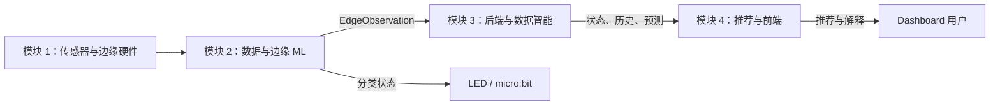

# Privacy-Preserving Study Space Advisor

面向校园学习空间的隐私保护型 AIoT 推荐系统。Raspberry Pi 5 融合低分辨率热阵列、mmWave 雷达、声音强度、光照和温湿度信号，在本地判断房间状态；后端保存历史并预测短期占用；推荐层结合用户偏好生成房间排序和解释。

> 当前阶段：保留四模块规格，按采集/边缘、服务/数据、展示三层代码骨架串行维护。当前只核验参考源码、许可证和骨架，不提前实现完整 ML、LLM 或 Dashboard。

## 隐私原则

- 不使用 RGB 摄像头、面部识别或身份追踪。
- 不保存原始语音，只处理声音强度和统计特征。
- 热阵列用于整体占用和活动估计，不用于人员识别。
- LLM 只接收结构化状态、预测和匿名偏好，不接收原始传感器数据。

## 目标系统架构



## 四个模块

| 模块 | 代码目录 | 执行规格 | 主要交付 |
|---|---|---|---|
| 1. 传感器与边缘硬件 | `edge/hardware/` | [`01_SENSOR_EDGE_HARDWARE.md`](docs/module-specs/01_SENSOR_EDGE_HARDWARE.md) | 采集、窗口化、模拟器、本地指示 |
| 2. 数据与边缘 ML | `edge/ml/` | [`02_EDGE_ML_PIPELINE.md`](docs/module-specs/02_EDGE_ML_PIPELINE.md) | 特征、训练、模型包、Pi 推理 |
| 3. 后端与数据智能 | `backend/` | [`03_BACKEND_DATA_INTELLIGENCE.md`](docs/module-specs/03_BACKEND_DATA_INTELLIGENCE.md) | API、数据库、历史与预测 |
| 4. 推荐与前端 | `frontend/` 及后端推荐适配层 | [`04_RECOMMENDATION_FRONTEND.md`](docs/module-specs/04_RECOMMENDATION_FRONTEND.md) | 排序、LLM fallback、Dashboard |

所有实现者必须先阅读 [`00_SHARED_CONTRACT.md`](docs/module-specs/00_SHARED_CONTRACT.md)。

## 三层代码骨架

四个业务模块不需要改名或搬迁；它们在代码层面归入以下三层：

| 层 | 目录 | 当前边界 |
|---|---|---|
| 采集与边缘层 | `edge/hardware/`、`edge/ml/` | 模块 01 保留已实现的驱动、采集和本地指示；模块 02 当前只保留入口骨架 |
| 服务与数据层 | `backend/`、`shared/` | 保留现有后端成果与共享契约，本阶段不扩展预测或大模型能力 |
| 展示层 | `frontend/` | 当前只保留模块入口说明，不开发 Dashboard |

`tests/integration/` 是跨层验证入口，不属于任一业务层。各层之间只能通过 `shared/contracts/` 中的契约交换数据。

## 从这里开始

完整的安装、分支、AI 使用、开发和集成教学见：

**[项目使用与协作教程](docs/USAGE_GUIDE.md)**

快速流程：

```bash
git clone <repository-url>
cd Privacy-Preserving-Study-Space-Advisor
git switch -c module1/hardware
```

然后把共享契约和对应模块规格一起交给 AI，要求它先检查仓库、给出计划，再在模块目录内实现并运行测试。

## 仓库结构

```text
.
|-- edge/
|   |-- hardware/          # 模块 1
|   `-- ml/                # 模块 2
|-- backend/               # 模块 3；模块 4 的推荐 adapter 在此集成
|-- frontend/              # 模块 4
|-- shared/
|   |-- contracts/         # JSON Schema 和枚举
|   `-- fixtures/          # 跨模块固定测试负载
|-- tests/integration/     # 端到端契约测试
|-- docs/
|   |-- module-specs/      # AI 可执行目标文档
|   `-- USAGE_GUIDE.md
|-- AGENTS.md              # AI 仓库级规则
`-- CONTRIBUTING.md
```

## 集成里程碑

1. **Gate A — 模拟数据贯通**：模拟窗口经过边缘推理、后端写入并在 Dashboard 显示。
2. **Gate B — 真实传感器贯通**：MLX90640、LD2450 和至少一个环境/声音传感器运行。
3. **Gate C — 推荐与降级**：三个房间可排序；关闭 LLM 或一个传感器后核心功能仍可用。
4. **Gate D — 最终演示**：连续运行 15 分钟，展示状态、趋势、预测、偏好、推荐和本地指示。

## 项目文档

- [共享系统契约](docs/module-specs/00_SHARED_CONTRACT.md)
- [贡献与 Pull Request 规则](CONTRIBUTING.md)
- [项目使用与协作教程](docs/USAGE_GUIDE.md)

原始 Proposal 含组员信息，默认保留在团队本地资料目录，不上传仓库。需要纳入 GitHub 时，应先生成脱敏版本并由全组确认。
